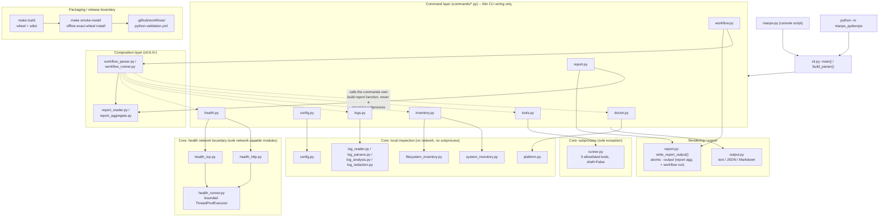
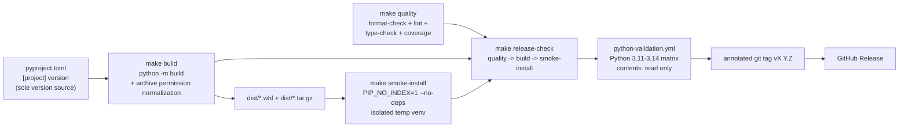

# Architecture

This document covers the complete Day 1-7 (v0.1.0-v0.7.0) architecture:
package layout, entry points, CLI dispatch, per-command data flow, typed
models, exit codes, versioning, safety boundaries, tests, and (new for
v0.7.0) the packaging/release boundary. See
[docs/portfolio-guide.md](portfolio-guide.md) for the narrative "why,"
and [docs/release-process.md](release-process.md) for the release
workflow this document's final section summarizes.

## System overview



Solid arrows are direct calls; dashed arrows from `workflow_runner.py`
are calls into each command's own existing orchestration function (the
same one its equivalent standalone CLI subcommand calls), never a
parallel reimplementation. The packaging/release boundary at the bottom
is a build-time/CI-time concern, not a runtime data flow — see section 10
below and [docs/release-process.md](release-process.md) for its complete
process.

## 1. Package layout

`src`-layout, so the installed package can never accidentally import
from the working directory instead of the installed distribution:

```
src/maops_pydevops/
    __init__.py     # imports get_version reference only; no import-time side effects
    __main__.py      # python -m maops_pydevops
    cli.py            # argparse construction + dispatch
    version.py         # authoritative version lookup (importlib.metadata, lazy)
    commands/
        doctor.py         # required + optional checks, build_report()
        config.py           # config CLI orchestration: build_show_report(), etc.
        tools.py              # allowlisted tool inspection, build_inspect_report()
        inventory.py            # inventory CLI orchestration: build_system_report(), build_filesystem_report()
        logs.py                   # logs CLI orchestration: build_log_parse_report(), build_log_analysis_report()
        health.py                  # health CLI orchestration: build_health_http_report(), build_health_tcp_report()
        report.py                    # report-aggregate CLI orchestration + shared atomic --output writer
        workflow.py                    # workflow validate/run CLI orchestration
    core/
        models.py           # enums + frozen dataclasses (doctor, tools-inspect)
        config_models.py      # config-domain enums + frozen dataclasses
        inventory_models.py     # inventory-domain enums + frozen dataclasses
        log_models.py             # log-domain enums + frozen dataclasses
        health_models.py            # health-domain enums + frozen dataclasses
        output.py                     # text/JSON rendering, all report types
        platform.py                     # injectable platform/python inspection
        config.py                         # config path/parse/validate/precedence/init
        runner.py                           # safe subprocess execution layer
        system_inventory.py                   # injectable host/OS/CPU/memory/uptime collection
        filesystem_inventory.py                 # bounded, deterministic filesystem scanner
        log_reader.py                             # fd-safe bounded binary log reader
        log_parsers.py                              # jsonl/syslog/auto line parsers
        log_redaction.py                              # bounded regex secret redaction
        log_analysis.py                                 # streaming aggregation, signatures, buckets
        health_http.py                                    # bounded HTTP availability checks (network-capable)
        health_tcp.py                                       # bounded TCP connect checks (network-capable)
        health_runner.py                                      # bounded, ordered concurrent.futures helper
        report_models.py                                        # report-aggregate-domain enums + frozen dataclasses
        report_reader.py                                          # bounded, fd-safe JSON report file reader
        report_aggregate.py                                         # report-kind detection, normalization, aggregation
        workflow_models.py                                            # workflow-domain enums + frozen dataclasses
        workflow_parser.py                                              # TOML parsing + schema validation (no execution)
        workflow_runner.py                                                # sequential step execution via commands/*.py
```

## 2. Entry points

Both invocation paths call the identical function:

- Console script: `pyproject.toml` `[project.scripts]` maps `maops-py` to
  `maops_pydevops.cli:main`.
- Module invocation: `__main__.py` does `sys.exit(main())`, importing
  `main` from `cli.py`.

There is exactly one `main()` implementation. Neither entry point
contains its own command logic.

## 3. CLI construction vs. execution

`cli.py` separates **parser construction** (`build_parser()` — wires
flags and subcommands, runs no logic) from **execution**
(`run_version()`, `run_doctor()`, `run_config_*()`, `run_tools_inspect()`
— do the actual work and return an exit code). `main()` parses arguments,
then dispatches through a small `dict[str, Callable]` command table keyed
by subcommand name. Argparse's own behavior (not custom code) handles
`-h/--help` and invalid-choice errors for every `choices=`-backed option
and subcommand. The one exception is `tools inspect`'s `tool` positional:
tool-name validation happens in `run_tools_inspect()` itself, not via
argparse `choices=`, because that combination proved to have
version-dependent behavior between Python 3.11 and 3.12 (see
`CHANGELOG.md`'s `[0.2.0]` "Fixed" entry). It still produces exit `2` for
an unsupported name.

`config`, `tools`, and `inventory` are two-level command groups (`config
show`, `tools inspect`, `inventory system`, `inventory filesystem`,
etc.). Each group has its own
`add_subparsers(dest="<group>_command", required=True)` and its own flat
dispatch dict (`_CONFIG_COMMANDS`, `_TOOLS_COMMANDS`,
`_INVENTORY_COMMANDS`), collected under `_COMMAND_GROUPS`. A bare
`maops-py config` (or `tools`, or `inventory`) with no leaf subcommand is
rejected by argparse itself via `required=True`, exit 2.

`--version` is checked first in `main()`, before subcommand dispatch —
but only after `parser.parse_args()` itself has already succeeded.
Whenever parsing succeeds, `--version` always short-circuits:
`maops-py --version doctor` and `maops-py --version inventory system`
both print only the version and exit 0, regardless of what complete
subcommand path follows. It does **not** short-circuit an *incomplete*
two-level group given with no leaf subcommand: `maops-py --version tools`
still exits 2, because argparse's own `required=True` validation on the
nested subparser raises a usage error during `parse_args()` itself,
before `main()` ever reaches the `args.version` check. `maops-py doctor
--version` is a separate case entirely: `--version` is a top-level-only
flag, never added to any subparser, so this is an argparse "unrecognized
arguments" usage error (exit 2).

## 4. Data flow: doctor

```
commands/doctor.py:build_report()
    core/platform.py:gather_python_info()/gather_platform_info()
    commands/doctor.py: run required checks (fixed order)
    commands/doctor.py: run optional tool checks (fixed order, shutil.which only)
    -> core/models.py:DoctorReport (frozen dataclass)

cli.py:run_doctor()
    core/output.py:render_text() or render_json()
    -> print once, return exit code from DoctorReport.overall
```

Optional tool checks never affect `overall` — only required-check
failures do, per the exit-code convention below.

## 4a. Data flow: configuration

```
core/config.py:resolve_config_path()        # MAOPS_PY_CONFIG_FILE > XDG_CONFIG_HOME > HOME
core/config.py:parse_toml_file()            # tomllib.load(), missing vs malformed distinguished
core/config.py:validate_config_schema()     # unknown keys, bool-as-numeric, range checks
core/config.py:resolve_effective_config()   # CLI > environment > file > default, per field
    -> core/config_models.py:ConfigResolution (config, sources, or a typed error)

commands/config.py:build_show_report()
    -> core/config_models.py:ConfigShowReport
cli.py:run_config_show()
    core/output.py:render_config_show_text() or render_config_show_json()
```

An invalid file or an invalid `MAOPS_PY_*` environment variable never
produces a partial or misleading report: `resolve_effective_config()`
returns `config=None` with a human-readable `error`, and every `config`
subcommand that depends on it fails operationally (exit 1) instead of
silently falling back to a lower-precedence source.

## 4b. Data flow: tool inspection

```
commands/tools.py:TOOL_ALLOWLIST                # fixed (name, argv) pairs, 5 tools only
commands/tools.py:build_inspect_report()
    shutil.which(name)                          # resolve absolute executable path
    core/runner.py:run_command(CommandSpec)     # shell=False, timeout, truncation
    -> core/models.py:ToolInspectionResult (per tool)
    -> core/models.py:ToolsInspectReport (overall)

cli.py:run_tools_inspect()
    core/output.py:render_tools_inspect_text() or render_tools_inspect_json()
```

`run_command()` is the only function in this package that imports
`subprocess`; see `docs/subprocess-safety.md` for its full contract.

## 4c. Data flow: inventory system

```
core/system_inventory.py:gather_host_info()/gather_distribution_info()/
    gather_python_info()/gather_cpu_info()/gather_memory_info()/
    gather_uptime_info()                        # fixed call order, each independently degradable
    -> (model, InventoryIssue | None) per source
core/system_inventory.py:build_system_report()
    collects non-None issues in the same fixed order
    -> core/inventory_models.py:SystemInventoryReport

cli.py:run_inventory_system()
    core/output.py:render_inventory_system_text() or render_inventory_system_json()
    -> print once, always exit 0 for a successfully-built report
```

Every optional data source degrades independently to `null` fields plus
one warning `InventoryIssue`, rather than aborting the whole report; see
`docs/inventory.md` for the full field-level contract. Unlike `doctor`
and `tools inspect`, this report's `overall` status and its exit code are
deliberately decoupled — see `docs/subprocess-safety.md`'s "Exit-code and
warning semantics across commands" section.

## 4d. Data flow: inventory filesystem

```
core/filesystem_inventory.py:build_filesystem_report()
    os.lstat(root)                              # root classification; the only
                                                 # (report=None, error) exit-1 path
    _scan_directory()                           # explicit depth-first recursion,
                                                 # os.scandir() per directory, name-sorted
    -> core/inventory_models.py:FilesystemInventoryReport

cli.py:run_inventory_filesystem()
    core/output.py:render_inventory_filesystem_text() or render_inventory_filesystem_json()
    -> print once, exit 1 only if root could not be classified, else exit 0
```

See `docs/filesystem-inventory-safety.md` for the complete traversal,
symlink, same-filesystem, and race-handling contract.

## 4e. Data flow: logs parse

```
core/log_reader.py:open_bounded_log_file()   # os.lstat + O_NOFOLLOW/O_CLOEXEC/O_NOATIME
                                              # open + os.fstat dev/inode TOCTOU check
                                              # -> (BoundedLogReader, None, None) or
                                              #    (None, LogReadFailureReason, detail)
commands/logs.py:build_log_parse_report()
    reader.read_lines()                      # bounded, sequential, never mmap/whole-file
    core/log_parsers.py:parse_jsonl_line()/parse_syslog_line()/parse_auto_line()
        core/log_redaction.py:redact_message()   # message field only, before event construction
    -> core/log_models.py:LogParseReport (frozen dataclass)

cli.py:run_logs_parse()
    core/output.py:render_logs_parse_text() or render_logs_parse_json()
    -> print once, exit 1 only if the file could not be opened at all
       or overall is FAIL (non-empty input, zero parsed events)
```

`--max-events` bounds report *retention*, not parsing — every line is
still parsed and counted in `events_parsed` regardless of the cap. See
`docs/log-parsing.md` for the complete field and grammar contract.

## 4f. Data flow: logs analyze

```
core/log_reader.py:open_bounded_log_file()   # identical to logs parse
commands/logs.py:build_log_analysis_report()
    reader.read_lines() -> per-line parse (same parsers/redaction as logs parse)
    core/log_analysis.py:LogAnalysisState.process_event()   # one event at a time, discarded after
        -> severity_counts, source_counts, per-signature aggregates, time buckets
    core/log_analysis.py:build_findings()        # fixed-order, threshold-based, advisory
    -> core/log_models.py:LogAnalysisReport (frozen dataclass)

cli.py:run_logs_analyze()
    core/output.py:render_logs_analyze_text() or render_logs_analyze_json()
    -> print once, exit 1 only if the file could not be opened at all
       or overall is FAIL (non-empty input, zero parsed events)
```

No individual `LogEvent` is retained across the streaming pass — only
small per-distinct-value aggregates (`LogAnalysisState`). See
`docs/log-analysis.md` for the aggregation, signature-normalization, and
time-bucket contract, and `docs/log-redaction.md` for the redaction
contract shared with `logs parse`.

## 4g. Data flow: health check

```
commands/health.py:build_health_http_report()/build_health_tcp_report()
    core/health_http.py:validate_http_target()/                # every target validated
    core/health_tcp.py:validate_tcp_target()                   # before any socket opens
    core/health_runner.py:run_bounded_parallel()                # ThreadPoolExecutor,
        core/health_http.py:run_http_target_with_retries()      # one worker per target,
        core/health_tcp.py:run_tcp_target_with_retries()        # retries sequential per-worker
            core/health_http.py:_perform_http_attempt()          # http.client, ssl -- no urllib.request
            core/health_tcp.py:_perform_tcp_attempt()             # socket, connect-only
    -> core/health_models.py:HttpReport / TcpReport (frozen dataclass)

cli.py:run_health_http()/run_health_tcp()
    core/output.py:render_health_http_text()/_json() or render_health_tcp_text()/_json()
    -> print once, exit 2 if report is None (target-validation failure),
       1 if overall is FAIL, else 0
```

This is the first, and only, data flow in the package that opens a
network connection. `core/health_http.py` and `core/health_tcp.py` are the
sole modules permitted to import `socket`/`ssl`/`http.client`;
`core/health_runner.py` is the sole module permitted to import
`concurrent.futures`. Report ordering always matches original CLI target
order, regardless of which target's checks complete first — see
`core/health_runner.py:run_bounded_parallel()`'s pre-sized,
index-addressed result list. See `docs/health-checks.md` for the full
CLI/report contract and `docs/http-health-safety.md` for the complete
network safety model.

## 4h. Data flow: report aggregate

```
core/report_reader.py:read_report_file()      # os.lstat + O_NOFOLLOW/O_CLOEXEC open +
                                                # os.fstat dev/inode TOCTOU check, bounded read,
                                                # -> (dict, None, None) or (None, reason, detail)
core/report_aggregate.py:build_aggregate_report()
    read every path, in exact CLI order
    core/report_aggregate.py:detect_report_kind()   # structural key-shape detection, 8 fixed kinds
    core/report_aggregate.py:normalize_report()     # per-kind field extraction -> small typed summary
    -> core/report_models.py:AggregateReport (frozen dataclass)

cli.py:run_report_aggregate()
    core/output.py:render_report_aggregate_text()/_json()/_markdown()
    commands/report.py:write_report_output()    # atomic --output write, or print to stdout
    -> exit 2 if report is None (read/detect/normalize failure),
       1 if overall is FAIL or --output write failed, else 0
```

`detect_report_kind()` is purely structural (a fixed, unique combination
of top-level JSON keys per kind) — there is no fallback path that accepts
an unrecognized JSON object. `normalize_report()` never copies an entire
input report into the aggregate; see `docs/aggregated-reports.md` for the
complete normalization contract.

## 4i. Data flow: workflow

```
core/workflow_parser.py:parse_workflow_file()   # tomllib.load() + validate_workflow_document()
                                                 # pure parsing/type/range checks, no I/O beyond
                                                 # reading the TOML file itself; reuses
                                                 # core/health_http.py:validate_http_target() /
                                                 # core/health_tcp.py:validate_tcp_target() and
                                                 # commands/tools.py:TOOL_ALLOWLIST for target/tool
                                                 # validation -- never executes a step
    -> (Workflow, None) or (None, error)

commands/workflow.py:build_workflow_validation_report()
    -> core/workflow_models.py:WorkflowValidationReport
cli.py:run_workflow_validate()
    -> exit 0 if valid, 2 if invalid

commands/workflow.py:build_workflow_run_report()
    core/workflow_parser.py:parse_workflow_file()   # validated first, exactly as workflow validate
    core/workflow_runner.py:run_workflow()
        _run_step() once per declared step, in order      # calls the same build_*_report()
            commands/doctor.py:build_report()              # functions each equivalent CLI
            commands/tools.py:build_inspect_report()       # subcommand calls -- never a
            commands/inventory.py:build_system_report()/   # recursive maops-py subprocess
                build_filesystem_report()
            commands/logs.py:build_log_analysis_report()
            commands/health.py:build_health_http_report()/
                build_health_tcp_report()
        core/report_aggregate.py:normalize_report()    # reused directly on each step's own
                                                         # real report.to_dict()
    -> core/workflow_models.py:WorkflowRunReport (frozen dataclass)

cli.py:run_workflow_run()
    core/output.py:render_workflow_run_text()/_json()/_markdown()
    commands/report.py:write_report_output()    # the identical atomic --output writer
    -> exit 2 if report is None (schema/validation failure, checked before any step runs),
       1 if overall is FAIL or --output write failed, else 0
```

`core/workflow_runner.py` is the one module under `core/` permitted to
import from `commands/` — its entire purpose is orchestrating across
other commands' own orchestration functions, not a parallel
reimplementation of them. Steps always execute sequentially, in declared
order; a step that cannot produce a report becomes a FAIL result rather
than aborting the run, so a later failure never discards earlier steps'
already-completed results. `inventory_filesystem`/`logs_analyze` relative
paths resolve against the workflow file's own directory via a pure
lexical join (`core/workflow_runner.py:_resolve_relative()`), never the
process's actual working directory, and `os.chdir()` is never called
anywhere in this package. See `docs/workflows.md` and
`docs/workflow-security.md` for the complete schema, execution, and
security contracts.

## 5. Typed models

`core/models.py` defines `CheckStatus` and `OutputFormat` as
`StrEnum`, and `PythonInfo`, `PlatformInfo`, `DoctorCheck`, `DoctorReport`,
`ToolInspectionResult`, `ToolsRunConfiguration`, `ToolsInspectReport` as
`frozen=True` dataclasses with explicit `to_dict()`/`to_json()` methods.
`core/config_models.py` follows the identical convention for the
configuration domain: `ConfigSource`, `ConfigFileStatus`, `ConfigInitStatus`
as `StrEnum`; `EffectiveConfig`, `EffectiveConfigSources`, `ConfigResolution`,
`ConfigShowReport`, `ValidatedConfigValues`, `TomlParseResult`,
`SchemaValidationResult`, `ConfigInitResult` as `frozen=True` dataclasses.
`core/inventory_models.py` follows the same convention for the inventory
domain, split into its own file rather than extending `core/models.py`
because it introduces over a dozen new dataclasses across two
sub-domains: a shared `InventoryIssue`; `HostInfo`, `DistributionInfo`,
`SystemPythonInfo`, `CpuInfo`, `MemoryInfo`, `UptimeInfo`,
`SystemInventoryReport` for `inventory system`; `FilesystemScanOptions`,
`FilesystemScanSummary`, `LargestFileEntry`, `FilesystemInventoryReport`
for `inventory filesystem`. It reuses `CheckStatus` from `core/models.py`
rather than defining a new status enum. `core/log_models.py` follows the
same convention for the log domain: `LogSeverity`, `LogInputFormat`,
`LogParseIssueCode`, `LogAnalysisFindingCode` as `StrEnum`; `LogEvent`,
`LogParseIssue`, `LogParseReport`, `SignatureEntry`, `SourceCount`,
`LogAnalysisTime`, `LogAnalysisFinding`, `LogAnalysisReport`, and their
supporting option/summary dataclasses as `frozen=True`. It also reuses
`CheckStatus` for report `overall` and finding/issue status, rather than
introducing a fourth status enum. `core/health_models.py` follows the
same convention for the health-check domain: `HealthProtocol`,
`HttpFailureReason`, `TcpFailureReason` as `StrEnum` (lowercase, matching
their JSON spelling); `HttpMethod` is the one deliberate exception —
its values are uppercase (`GET`, `HEAD`) to match `--method`'s CLI
spelling exactly, since the convention's real invariant is "matches CLI
spelling," not "always lowercase." `HttpOptions`/`TcpOptions`,
`HttpAttempt`/`TcpAttempt`, `HttpTargetResult`/`TcpTargetResult`,
`HttpSummary`/`TcpSummary`, `HttpReport`/`TcpReport` are `frozen=True`,
reusing `CheckStatus` for per-target/report status. Serialization never uses
`dataclasses.asdict()` or dict spreading — every
field is written out explicitly so the JSON schema is traceable directly
from the code. No custom exception classes are introduced anywhere: every
public function in `core/config.py` and `core/runner.py` returns a typed
result dataclass instead of raising past its own boundary, extending the
same pattern `DoctorCheck.status` already established in Day 1.
`core/report_models.py` follows the same convention for the report-
aggregate domain: `ReportKind`, `ReportOutputFormat` as `StrEnum`;
`ReportMetric`, `NormalizedReport`, `AggregateOptions`, `AggregateSummary`,
`AggregateReport` as `frozen=True` dataclasses, reusing `CheckStatus` for
per-report/aggregate status. `core/workflow_models.py` follows it for the
workflow domain: `WorkflowStepKind`, `WorkflowValidationStatus` as
`StrEnum`; one `frozen=True` parameter dataclass per step kind
(`DoctorStepParams`, `ToolsInspectStepParams`,
`InventorySystemStepParams`, `InventoryFilesystemStepParams`,
`LogsAnalyzeStepParams`, `HealthHttpStepParams`, `HealthTcpStepParams`,
unioned as the `StepParams` type alias — never a generic
`dict[str, object]` step representation); `Workflow`, `WorkflowStep`,
`WorkflowValidationReport`, `WorkflowRunOptions`, `WorkflowRunSummary`,
`WorkflowStepResult`, `WorkflowRunReport` as `frozen=True` dataclasses,
also reusing `CheckStatus`. `WorkflowStepResult`'s `metrics` field reuses
`core/report_models.py:ReportMetric` directly (rather than a duplicate
workflow-domain metric type), since `core/workflow_runner.py` calls
`core/report_aggregate.py:normalize_report()` on each step's own report.

## 6. Exit-code convention

- `0` — success
- `1` — operational or required-check failure (doctor's `overall` is
  `fail`)
- `2` — CLI usage error (unknown command, invalid `--format`, no
  subcommand)

This top-level convention holds everywhere, but what counts as a `1`
varies meaningfully by command — see `docs/subprocess-safety.md`'s
"Exit-code and warning semantics across commands" section for the full,
per-command breakdown. Notably, `inventory system`/`inventory
filesystem` decouple their `overall` report field from their exit code:
both always exit `0` for a successfully-produced report regardless of
`overall` being `pass` or `warn`, since partial optional data being
unavailable (system) or a recoverable per-entry scan issue (filesystem)
is never an operational failure — only a report that could not be built
at all is.

## 7. Versioning

`pyproject.toml`'s `[project] version` is the only place the version
number is written. `version.py::get_version()` reads it back via
`importlib.metadata.version(...)` at call time, never at import time.

## 8. Safety boundaries

`commands/doctor.py` never imports `subprocess`; optional tool presence
is checked with `shutil.which()` only. `core/runner.py` is the sole,
narrowly scoped exception to "no subprocess": it never sets `shell=True`,
never invokes a shell, always uses `stdin=subprocess.DEVNULL`, and is only
ever called by `commands/tools.py` with one of five fixed, hardcoded argv
tuples (`git`/`docker`/`kubectl`/`terraform`/`ansible` version checks) —
Day 2 does not expose an arbitrary command-execution CLI. `core/config.py`
is the sole module permitted to read named environment variables
(`MAOPS_PY_*`, `XDG_CONFIG_HOME`, `HOME`) and to write outside a
test/build temporary directory, and only under the user's own
configuration directory. `core/system_inventory.py` and
`core/filesystem_inventory.py` never import `subprocess` or `socket`, and
never read named environment variables — `inventory system` collects
host/OS/CPU/memory/uptime facts via `platform`/`os` introspection only,
and `inventory filesystem` reads only filesystem metadata
(`os.lstat`/`os.scandir`/`entry.stat`), never file content, never a hash.
No module performs network I/O or dumps the full environment.
`core/log_reader.py` is the first module in this package to open and
read file *content* (`core/report_reader.py` is the second, and the only
other one — see below; every other module reads only metadata or fixed
subprocess output): it validates a path with `os.lstat()`, opens with
`O_NOFOLLOW`/`O_CLOEXEC`/`O_NOATIME` where available, verifies the
opened descriptor with `os.fstat()` against a `(st_dev, st_ino)`
comparison to the pre-open `lstat()` result (detecting a file replaced
between the check and the open), and reads bounded, sequential binary
chunks — never `mmap`, never a whole-file read. `core/log_models.py`,
`core/log_parsers.py`, `core/log_redaction.py`, and `core/log_analysis.py`
never import `subprocess` or `socket`, and never read named environment
variables. `core/health_http.py` and `core/health_tcp.py` are the first
(and only) modules in this package permitted to import `socket`, `ssl`,
or `http.client` — Day 5's health checks are the package's first
intentional network access, deliberately isolated to these two modules
plus `core/health_runner.py` (permitted to import `concurrent.futures`)
and `commands/health.py` (orchestration only). Every other module's
"no network" invariant is unchanged and is verified by a dedicated
regression test (`tests/unit/test_no_network_health_boundary.py`).
`core/report_reader.py` mirrors `core/log_reader.py`'s fd-safety pattern
(`os.lstat()` pre-check, `O_NOFOLLOW`/`O_CLOEXEC` open, `os.fstat()`
dev/inode TOCTOU verification) for reading JSON report file content, but
reads the whole (bounded) document rather than a sequential line stream,
since a report must be parsed as a single JSON object.
`core/workflow_parser.py` reads a workflow TOML file with the simpler
`Path.open("rb")` + `tomllib.load()` pattern `core/config.py` already
established (a locally authored, explicitly supplied file at the same
trust level as a configuration file), and never imports `subprocess`,
`socket`, `ssl`, or `http.client` — see
`tests/unit/test_workflow_no_network_no_subprocess.py`, which proves
validating a workflow declaring every network/subprocess-capable step
kind makes no such call. `core/workflow_runner.py` is the sole module in
`core/` permitted to import from `commands/`, and executes steps only
through the package's own existing `commands/*.py` orchestration
functions — never a shell, never a recursive `maops-py` subprocess. See
`.claude/CLAUDE.md` for the full restriction list,
`docs/subprocess-safety.md` / `docs/configuration.md` for those two
modules' complete contracts, `docs/inventory.md` /
`docs/filesystem-inventory-safety.md` for the inventory modules',
`docs/log-parsing.md` / `docs/log-analysis.md` / `docs/log-redaction.md`
for the log modules', and `docs/aggregated-reports.md` /
`docs/workflows.md` / `docs/workflow-security.md` for the report-
aggregate and workflow modules'.

## 9. Tests

`tests/unit/` exercises models, platform logic, doctor checks, config
resolution/validation/init, the subprocess runner, tool inspection,
system/filesystem inventory collection, and CLI dispatch in-process with
`monkeypatch` for anything host-dependent (tool presence, Python version,
OS family, environment variables, HOME, procfs content, real filesystem
races). No config test ever reads or writes the real invoking user's
HOME — every test isolates `HOME`/`XDG_CONFIG_HOME`/`MAOPS_PY_CONFIG_FILE`
via `monkeypatch.setenv` or an injected `env=` mapping. Filesystem
inventory tests always scan a `tmp_path`-scoped fixture tree, never the
real repository tree, and procfs-derived system-inventory tests inject
fabricated `/proc/meminfo`/`/proc/uptime` content directly rather than
depending on the real host's values. `tests/integration/` exercises the
actual entry points as subprocesses (`python -m maops_pydevops`, the
`maops-py` console script) to verify the two invocation paths are truly
equivalent, that import produces no output, and — for `tools inspect` —
using a deterministic stub executable (`scripts/smoke/fake-git`) rather
than a real, host-installed tool. `test_release_permissions.py` and
`test_release_artifacts.py` build into an isolated, `tmp_path`-scoped
output directory (`python -m build --outdir`) rather than the shared
repository `dist/`, so they are safe to run concurrently with `make
build`/`make quality` against the same working tree.

Log-reader tests never read a real system log file: every fixture is a
`tmp_path`-scoped file, including adversarial cases (a symlink, a FIFO,
a live `AF_UNIX` socket special file, a file replaced between check and
open via `monkeypatch`, paths with spaces/Unicode/shell metacharacters).
Parser and analysis tests never depend on the real host clock or locale.
`tests/integration/test_logs_cli_integration.py` exercises `logs
parse`/`logs analyze` through both entry points as real subprocesses, the
same way `test_inventory_cli_integration.py` does for `inventory`.

Health-check unit tests never open a real socket: `core/health_http.py`'s
and `core/health_tcp.py`'s single-attempt functions are exercised with
injected fake `http.client`/`socket` objects that raise if a forbidden
operation (reading a response body, sending TCP application data) is ever
attempted, and the retry state machine and bounded-concurrency helper are
tested with fully injected `sleep`/`clock`/worker-function collaborators —
no real time or network dependency anywhere in `tests/unit/`.
`tests/integration/test_health_http_loopback.py` and
`test_health_tcp_loopback.py` exercise real network behavior, but only
against real, locally bound `127.0.0.1` ephemeral-port servers/listeners
(`tests/conftest.py`'s `http_loopback_server`/`tcp_loopback_listener`
fixtures) — never a public host. `tests/unit/test_no_network_health_boundary.py`
and `test_health_no_forbidden_tokens.py` together prove the network
boundary described above: every non-health module still raises on a
mocked `socket.socket`/`socket.create_connection` call, and the health
modules import exactly the primitives (and none of the forbidden ones)
they're supposed to.

Report-aggregate tests never assume a fixed input schema is stable
folklore: `tests/unit/test_report_aggregate.py` builds its fixtures
directly from every current report model's real field names, and
`tests/integration/test_report_cli_integration.py` aggregates the
*actual* JSON produced by real `doctor`/`inventory system` subprocess
invocations rather than hand-typed fixtures alone, so a schema drift in
any source command's `to_dict()` would break this test, not silently
pass. `test_report_reader_error_paths.py` and
`test_report_aggregate_error_paths.py` exercise the fd-safety and
per-kind malformed-field branches with `monkeypatch`, mirroring
`test_log_reader_error_paths.py`'s established pattern.

Workflow tests never depend on real subprocess-launch or network timing
where a deterministic alternative exists:
`tests/unit/test_workflow_runner.py`/`test_workflow_runner_step_kinds.py`
monkeypatch each `commands/*.py` build function `core/workflow_runner.py`
imports by name, proving sequential ordering, prior-result preservation,
and relative-path resolution without depending on any real command's
actual behavior. `tests/integration/test_workflow_health_loopback.py`
exercises real `health_http`/`health_tcp` workflow steps, but only
against the same real, locally bound `127.0.0.1` fixtures the standalone
health-command loopback tests use. `test_health_tcp_loopback.py`'s
reversed-completion-order coverage deliberately avoids a delayed-listener
design (racy against interpreter-startup jitter observed empirically in
this project's own CI-adjacent environments) in favor of a target that
retries with a real, fixed sleep entirely internal to the one subprocess
under test — a fully deterministic timing differential with no
cross-process race.

## 10. Packaging and release boundary

This package is built and released as source distributions (sdist +
wheel) and GitHub Releases only — there is no PyPI publish step and no
runtime dependency beyond the Python standard library.



`version.py::get_version()` (section 7) reads `pyproject.toml`'s version
back via `importlib.metadata.version()` at call time, so the tag, the
installed package metadata, and the CHANGELOG's version heading are kept
in agreement by construction, not by manual synchronization — regression-
tested by `tests/unit/test_version.py`, including the doc-example-drift
check added in v0.7.0 that pins every CLI-output version example in
`README.md`/`docs/inventory.md`/`docs/health-checks.md`/
`docs/log-analysis.md`/`docs/log-parsing.md`/`docs/workflows.md` against
the real package version.

`make build`'s isolated PEP 517 build environment may fetch declared
`build-system.requires` from an index; only `make smoke-install`'s
exact-wheel installation step is deliberately offline
(`PIP_NO_INDEX=1 --no-deps`). See
[docs/release-process.md](release-process.md) for the complete,
step-by-step process this diagram summarizes, including the specialist-
review and blocker-remediation steps that happen between `make
release-check` passing locally and a pull request being opened.
